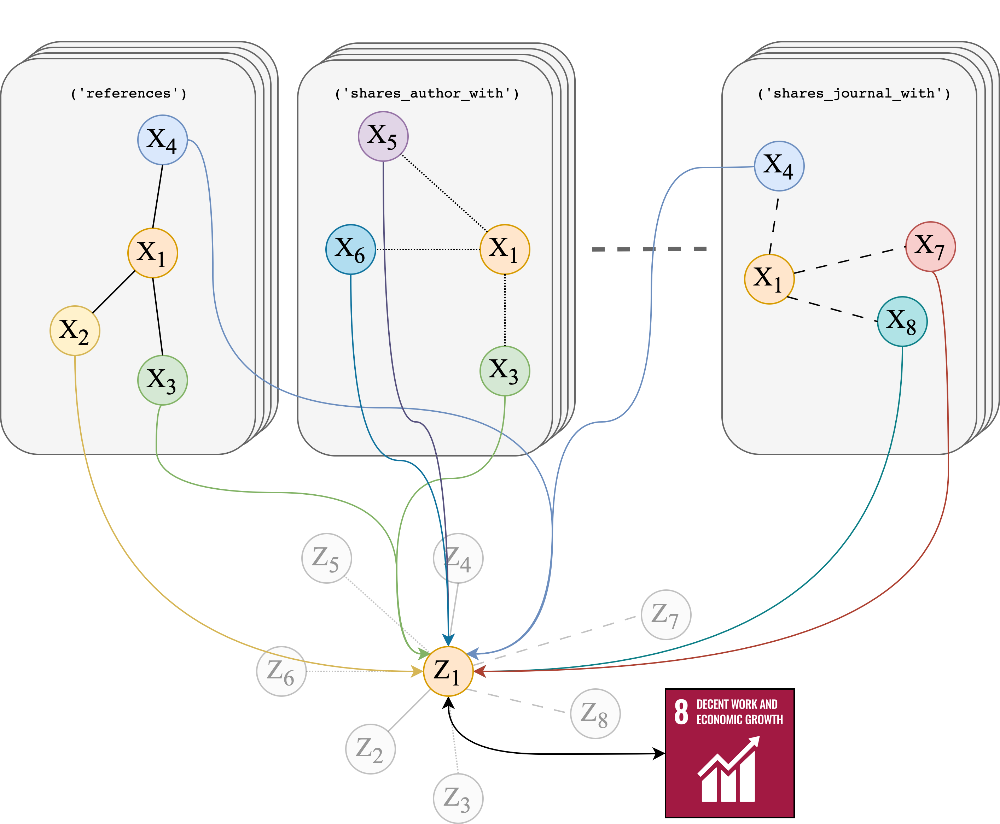

# Article Classification with Graph Neural Networks and Multigraphs

[](https://arxiv.org/abs/2309.11341)




Repository for the "Article Classification with Graph Neural Networks and Multigraphs" 2022-2023 UvA MSc Data Science thesis project, in collaboration with Elsevier.

Published as a conference paper at [LREC-COLING 2024](https://aclanthology.org/2024.lrec-main.136/) main track.

## Directory Overview ##
```
edgehetero-nodeproppred/
├─ config/
│  ├─ data_generation_config.yaml
│  ├─ experiments_config.yaml
├─ data/
│  ├─ embeddings/                       # node features.                    
│  ├─ tables/                           # MAG/PubMed metadata.
├─ models/                              # for checkpoints.
├─ notebooks/                           # metadata retrieval notebooks (for reference only).
├─ scripts/
│  ├─ experiments.py                    # main GNN training script.
│  ├─ models.py                         # GNN models.
│  ├─ multigraph.py                     # convert datasets to multigraphs.
│  ├─ simtg.py                          # SimTG LM PEFT.
│  ├─ utils.py
```

## Requirements
* Python 3.10
* PyTorch 1.13.1
* PyTorch Geometric 2.3.0 (+ pyg-lib, torch-sparse, torch-scatter)
* OGB 1.3.6
* Pandas
* NumPy
* tqdm
* PyArrow
* PyYAML
#### Additional requirements for SimTG finetuning:
* transformers 4.26.1
* datasets 2.10.1
* peft 0.7.1
* evaluate 0.4.1

## Reproduce Experiments ##
Repository should be cloned with Git LFS.

Pre-computed SimTG ([Duan et al., 2023](https://github.com/vermouthdky/SimTeG)) and TAPE ([He et al., 2024](https://github.com/XiaoxinHe/TAPE)) embeddings for both datasets can be downloaded in [this Drive folder](https://drive.google.com/drive/folders/1NxouExEaUufrrkh7SI_8TBSfXB-dLM15?usp=sharing). Place them in `data/embeddings`.

**Generate data**: run `python scripts/multigraph.py`, which generates and transforms the data object using the metadata files in `data/tables`. Specify the dataset to transform in `config/data_generation_config.yml`.

**To reproduce**: run `python scripts/experiments.py` to train model and print results. Dataset, model choice and all relevant parameters can be specified in `experiments_config.yaml`. The currently-set defaults will reproduce the ogbn-arxiv GraphSAGE results.

## Results ##
10-run average results on full-supervised transductive node classification using optimal multigraph configuration. See the paper for ablation results, baseline results on the unmodified graph, and parameter choices to reproduce individual cases.

| Dataset    | GNN    | Default      | SimTG        | TAPE         |
|------------|--------|--------------|--------------|--------------|
| OGBN-arXiv | GCN    | 71.88 ± 0.06 | 77.30 ± 0.09 | 77.10 ± 0.10 |
|            | GCN+JK | 71.56 ± 0.21 | 77.05 ± 0.10 | 76.66 ± 0.10 |
|            | SAGE   | 71.37 ± 0.21 | 77.39 ± 0.15 | 76.68 ± 0.06 |
|            | SGC    | 70.24 ± 0.05 | 77.24 ± 0.01 | 75.93 ± 0.17 |
| PubMed     | GCN    | 89.15 ± 0.14 | 93.49 ± 0.16 | 93.59 ± 0.26 |
|            | GCN+JK | 87.53 ± 0.62 | 94.11 ± 0.18 | 94.17 ± 0.13 |
|            | SAGE   | 89.75 ± 0.09 | 95.51 ± 0.10 | 94.93 ± 0.13 |
|            | SGC    | 86.56 ± 0.57 | 91.41 ± 0.13 | 91.20 ± 0.21 |