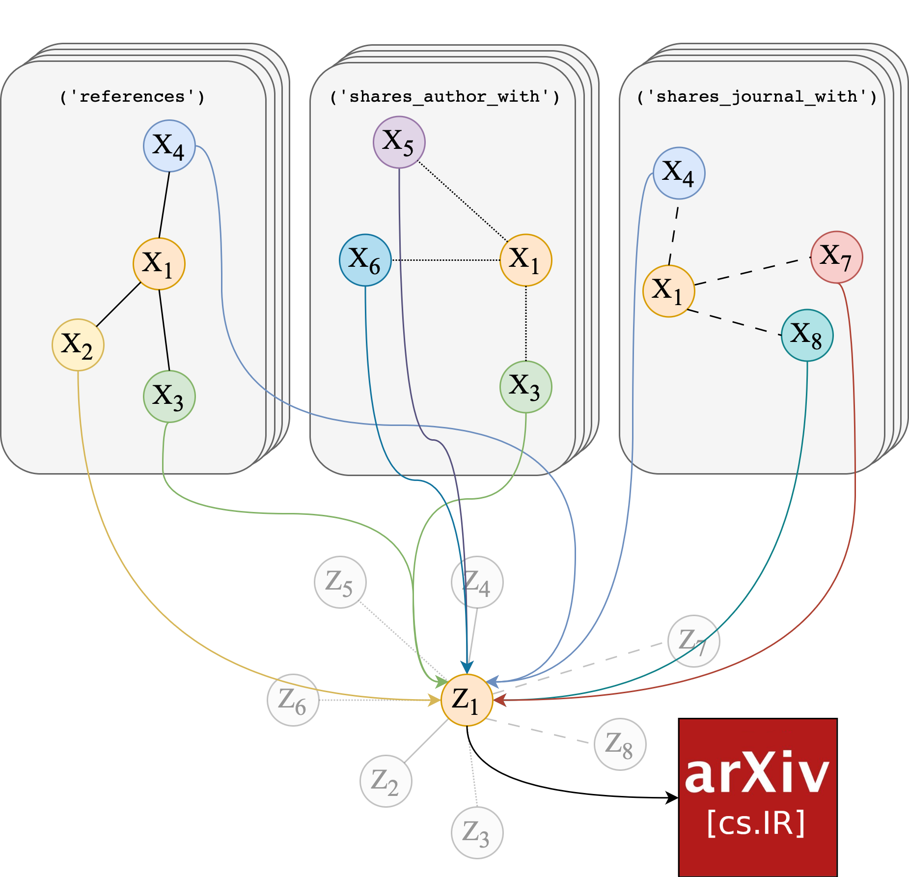

# edgehetero-nodeproppred



Repository for the "Improving Article Classification Using Edge-Heterogeneous Graph Neural Networks" 2022-2023 UvA MSc DS thesis project, in collaboration with Elsevier. Preprint on arXiv: https://arxiv.org/abs/2309.11341.

## Directory ##
```
edgehetero-nodeproppred/
├─ config/
│  ├─ data_generation_config.yaml
│  ├─ experiments_config.yaml
├─ data/
│  ├─ embeddings/                               # downloaded separately (see below).
│  │  ├─ ogbnarxiv_scibert_tensor_ordered.pt
│  │  ├─ pubmed_scibert_tensor_ordered.pt
│  ├─ tables/
│  │  ├─ ogbnarxiv_mag_metadata.parquet.gzip    # extracted MAG metadata.
│  │  ├─ pubmed_metadata.parquet.gzip           # extracted PubMed Central metadata.
│  │  ├─ Pubmed-Diabetes.DIRECTED.cites.tab     # PubMed citation edge list.
├─ models/
├─ notebooks/                                   # preprocessing notebooks for reference only.
│  ├─ ogbnarxiv_process_mag_data.ipynb
│  ├─ pubmed_process_baseline_data.ipynb
├─ scripts/
│  ├─ experiments.py
│  ├─ models.py
│  ├─ ogbnarxiv_hetero_transform.py
│  ├─ pubmed_hetero_transform.py
│  ├─ utils.py
├─ ehgnn_ogbnarxiv_technical_report.pdf
```

## Requirements
* Python 3.10
* PyTorch 1.13.1
* PyTorch Geometric 2.3.0 (+ pyg-lib, torch-sparse, torch-scatter)
* OGB 1.3.6
* Pandas
* NumPy
* tqdm
* PyArrow
* PyYAML

## Reproduce Experiments ##
Repository should be cloned with Git LFS.

The SciBERT embeddings are pre-computed; download links for [ogbn-arxiv](https://drive.google.com/file/d/1XubiRS2wqlR-_XcK7AGgITT0Cdx0mtdN/view?usp=share_link) and [PubMed](https://drive.google.com/file/d/1yrIJE0ko6sErUugBnN_GJCe-zqiDPwzV/view?usp=share_link). Place them in `data/embeddings`.

**Generate data**: run `python scripts/ogbnarxiv_hetero_transform.py` and/or `python scripts/pubmed_hetero_transform.py`, which generates and transforms the data object using the metadata files in `data/tables`.

**To reproduce**: run `python scripts/experiments.py` to train model and print results. Dataset, model choice and all relevant parameters can be specified in `experiments_config.yaml`. The currently-set defaults will reproduce the ogbn-arxiv GCN results. 

## Results ##
10-run average results on full-supervised transductive node classification. See the paper for ablation results and parameter choices to reproduce individual cases.

**ogbn-arxiv (provided split):**
| Model  	| Val. Acc.     	| Test Acc.     	| # Params  	|
|--------	|---------------	|---------------	|-----------	|
| GCN    	| 75.86% ± 0.12 	| 74.61% ± 0.06 	| 621,944   	|
| GCN+JK 	| 76.29% ± 0.07 	| 74.72% ± 0.24 	| 809,512   	|
| SAGE   	| 76.05% ± 0.07 	| 74.61% ± 0.13 	| 1,242,488 	|
| SGC    	| 75.15% ± 0.05 	| 74.19% ± 0.04 	| 92,280    	|

**PubMed (60/20/20 random per-class):**
| Model  	| Val. Acc.     	| Test Acc.     	| # Params  	|
|--------	|---------------	|---------------	|-----------	|
| GCN    	| 89.54% ± 0.25 	| 89.38% ± 0.40 	| 129,286   	|
| GCN+JK 	| 89.53% ± 0.46 	| 89.39% ± 0.64 	| 34,499   	|
| SAGE   	| 90.17% ± 0.38 	| 89.88% ± 0.47 	| 129,155 	|
| SGC    	| 87.15% ± 0.38 	| 86.98% ± 0.49 	| 3,006    	|